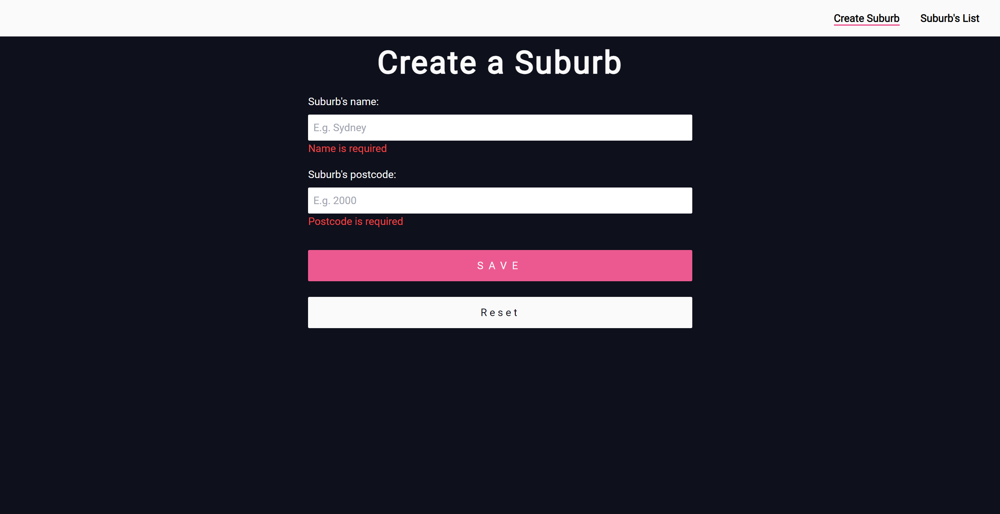
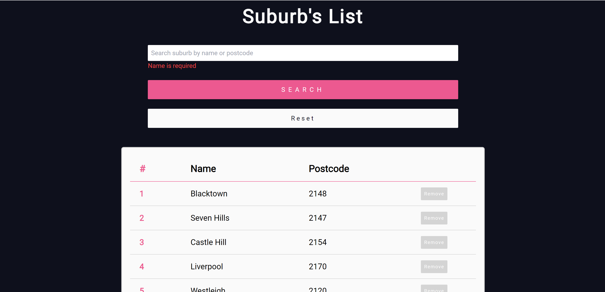
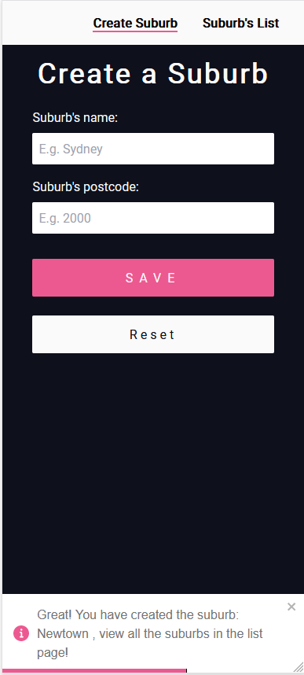

# Postcode Search
💻 Backend: [Click here!](https://github.com/marcelamejiao/Postcode-API)

## **Table of Contents** 

  - [**Table of Contents**](#table-of-contents)
  - [**Description**](#description)
  - [**My experience**](#my-experience)
  - [**Usage**](#usage)
  - [**Technologies Used**](#technologies-used)
  - [**Preview**](#preview)
  - [**Deployed link**](#deployed-link)
  - [**Future Development**](#future-development)
  - [**Questions**](#questions)


## **Description**

This project was designed to create a web application where suburbs can be added to a list by filling a form with the postcode and name fields, then you can view all the suburbs in a list and find the suburbs by filtering by name or postcode. The application also allows you to remove suburbs from this list. When creating or deleting a suburb a toast notification  message is displayed including the suburb's name.

This application consists of a Spring RESTful API and a React Typescript frontend styled with Tailwind.

## **My experience**

This project was designed only as a backend service, but I wanted to build the frontend to visualize the application and convert it into a CRUD app.
This project was a good practice to keep building up my Typescript skills. This time I built the services with TS instead of JS.  
This was also the first time that I finished an application using Tailwing as a CSS framework.

Tailwind was a very useful tool, but as it was new for me it took me more time than I expected to finish the styling that I designed. I needed to do quite a lot of googling but it was completely worth it! I created my own custom colours, implemented Google fonts and media queries making this application responsive on mobile devices.

Another learning experience was deploying using CapRover. I am still in this learning process, but this time I practiced by creating the enviromental variables and provide them to the App Configs, then inside my Github repository I added a Webhook to watch for any changes of my repository and my deployed app. 


## **Usage**

Install all dependecies:

```
npm i
```

To start the frontend using the terminal:

```
npm run dev 
```

## **Technologies Used**

* React
* Typescript
* Tailwind
* HTML
* Toastify package
* CapRover

## **Preview**

* **Create Suburb**



* **Suburb's list**



* **Mobile**


* **Toastify notification when creating a Suburb**



## **Deployed link**

To send live this application [Ruben](https://github.com/arg2009) help me out with the deployment on the server.

💡 Live version: [click here!](https://postcode-search.apps.marcelamejia.xyz/)

## **Future Development**

* Implement authentication.
  * Create login page.
* Testing.


## **Questions**

* Contact me on my GitHub profile: [Marcela's GitHub](https://github.com/marcelamejiao)

